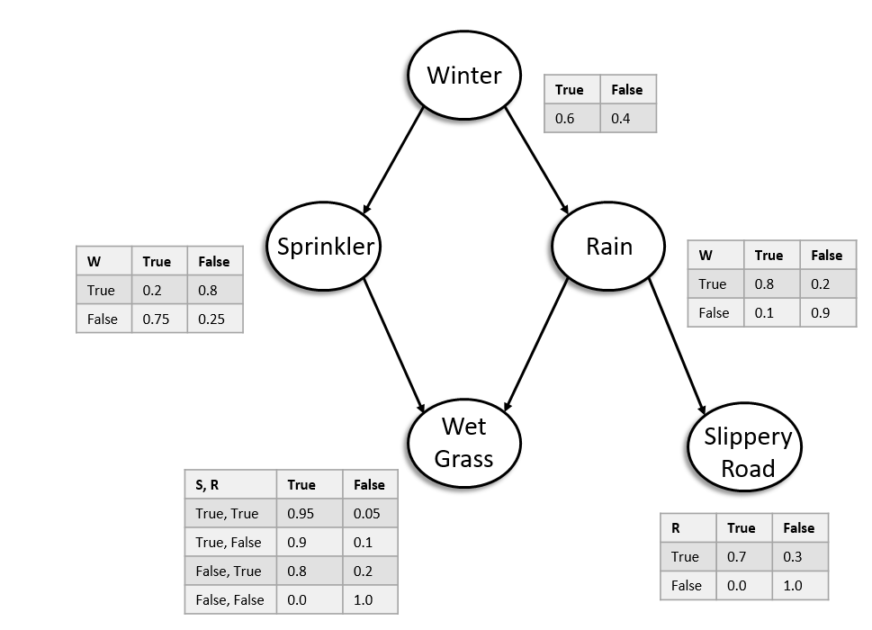

# Weather Bayesian Network

### This is a small implementation of bayesian solution for the following network

To run my application, run the main() in BaysianNetwork.java. 

Follow the prompts. You'll first identify query conditions in order 
by selecting the associated number with the node then say whether its true or false.

Say 'No' to stop identifying query conditions.

Do the same for given conditions. 

Say 'No' to run the query. 

Note: I the sample queries from the homework programmatically written in the main() function. 
To see their result, comment out the getUser..() functions and uncomment the test code. 