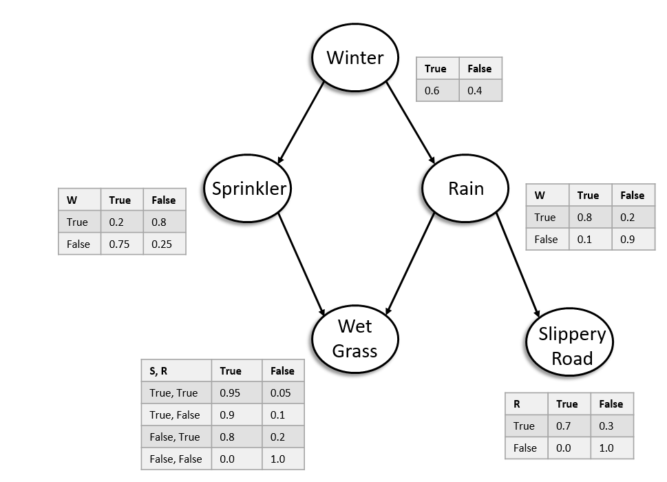

# Weather Bayesian Network

### Implementation of the following Bayesian Network

#### To Run

1. Navigate to root level directory of project
2. Run **ant all**
3. Run **run.bat**

#### Using the network

There will be a series of prompts to ask what probabilies need to be solved for and then what is known about the problem to be solved. 

1. Identify query conditions in order 
by selecting the associated number with the node then say whether its true or false.   -  Say 'No' to stop identifying query conditions. 
  
2. Do the same for given conditions.   -  Say 'No' to stop identifying given conditions.    
3. The query will then be run.

>Note: Progamatically written sample are commented out in the main() function. 
To see their result, comment out the getUser..() functions and uncomment the test code. 

#### What is the network solving?

The Bayesian network accepts a statement consisting of the query (the conditions for which we want to know the probability for) and the given conditions (what we know already).

>For example, the first sample query in BayesianNetwork.java is **Probability(SlipperyRoad = false | Winter = true)**    In English question form, this question would be **"What is the probability of the road not being slippery during winter?"**